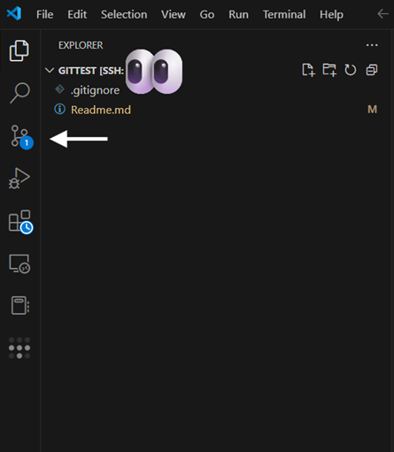
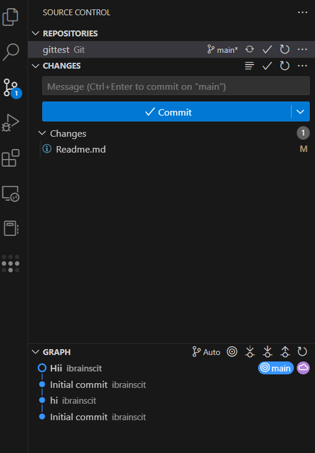

# howtousegithub
Tutorial on how to use git and github


## Initialize the repo inside the desired folder
```
git init
```
## Add the files
```
git add .
```
> The `.` means "add everything" in the current directory. You can also give specific names instead(git add file1.txt) This will only add these into git.
## Commit the changes
```
git commit -m "Commit Message"
```

## Add the remote url
```
git add remote origin https://github.com/ibrainscit/yourreponame
```
> change `yourreponame` to your repository name

## Push(upload code into github)
```
git push origin main
```

## After this the code will be uploaded to github .Open the same repository in browser itll be updated 

## Using vscode (for future commits)
### Step1 - click on shown place



## Step2 Type your commit message in `message box` and click on `commit` button and then click on `sync changes`



## To ignore specific files or folder so that they wont be tracked by git and so wont be uploaded to github (These include `api_key` file or `ssh_keys` or any thing which you dont want it to be public

### Create a file called `.gitignore` in folder where you initilized the repository

### Now you can add which files and folders you want .git will ignore those files

```
dataset_47gb/
model_weights/
api_key.txt
```

> This will ignore api_key.txt so that its not accidentally made public . And the files and folders inside the `dataset_47gb` and `model_weights` folder also will be ignored.  

## How to update to new changes using git commands

### Add the changes 
```
git add .
```

### Commit the code
```
git commit -m "Update message"
```

### Push code to github
```
git push origin main
```

---

# To Setup github in linux(already done in server)
## Install git
```
sudo apt install git
```

## Install gh
```
sudo apt install gh
```

## Login using gh
```
gh auth login
```
* select github.com
* HTTPS
* type the personal token
### once this is setup youll be authenticated 
